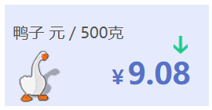

# 某鸭的同学录
<!--
编写说明：
什么是注释：像我这样由&lt;!--开始，由--&gt;结束的内容就是注释。(< = &lt; | > = &gt;)
需要保留注释吗：随便，你直接用内容覆盖掉也行。
可以删除条目吗：不可以。但你可以不填写部分条目。
填写完后该怎么样：请发给我，或者邮箱Yzcbs123@163.com，或者直接在GitHub上提交拉取请求。
必须同意所有协议吗：是的。
可以在哪里看到最终效果：条目##网站建议/定义链接的链接，可能要过会才会部署。
觉得这个表单太烂了，想自己写一个表单或直接写一个页面：可以的，这个表单仅作示例。
该用什么编辑这个文件：只要能编辑文本文件的都行，建议使用支持Markdown的编辑器(例如Visual Studio Code等)，官方教程见表末。
-->
## 基本信息
姓名:方锦程  别名:鸭鸭「カモ」  性别:男  生日:<!--可选-->  
其他信息:  
*Sleep all day.*  

班级: 八年15班  座号:41

照片:  
  

## 留言
想对同学们说的话:  
你还不知道我写的小工具?🤔，还不快来看看！  
- [芙芙工具箱](https://duckduckstudio.github.io/yazicbs.github.io/Tools/Fufu_Tools/)
- [中文Git](https://duckduckstudio.github.io/yazicbs.github.io/Tools/chinese_git/)

## 联系方式
QQ: 1707230454  
邮箱: <Yzcbs123@163.com>  
个人网站: [鸭鸭工作室](https://duckduckstudio.github.io/yazicbs.github.io/)  

## 网站建议
网页底色:默认<!--默认为#f5f5dc(米色)-->  
定义链接: https://duckduckstudio.github.io/同学录/鸭鸭/<!--以/结尾-->  
- [ ] 修改内容(初始提交请勿勾选)  
GitHub账户: [DuckDuckStudio](https://github.com/DuckDuckStudio/)  

## 协议
- [x] 你同意[鸭鸭工作室官网的隐私政策](https://duckduckstudio.github.io/yazicbs.github.io/privacy.html)
- [x] 你知晓你填写的信息**会被公开**
- [x] 你知晓我**可能不会维护部分问题**
- [x] 你知晓即使你是自定义表单**也要同意这些协议**

> 本示例使用Markdown语法编辑，官方教程[Markdown 官方教程](https://markdown.com.cn/)
